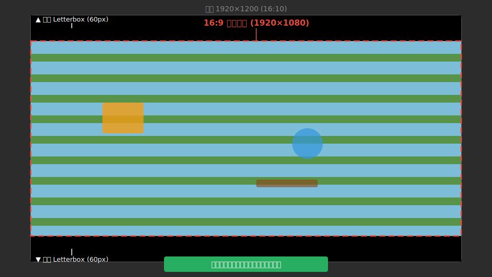
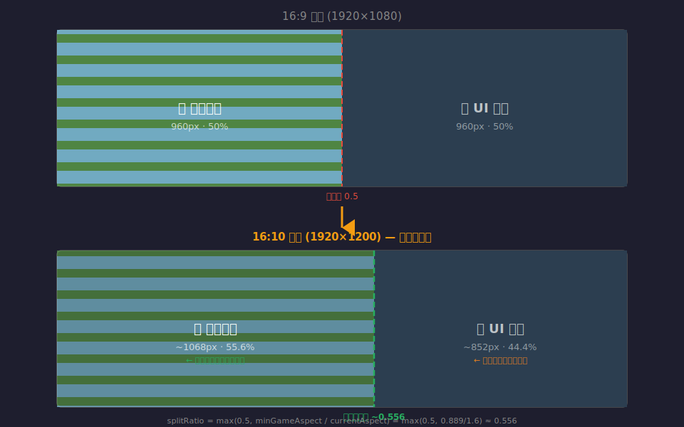
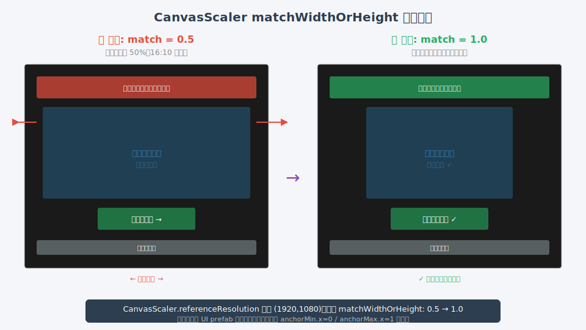
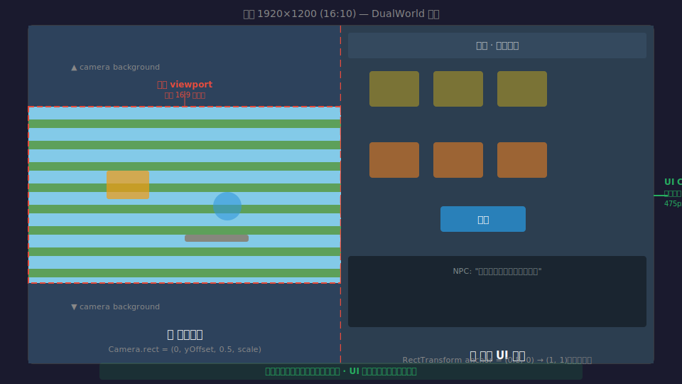

# 16:10 屏幕适配方案

> **实施记录（2026-06-17 修订）—— 以本节为准，下文方案 A~D 为当时调研留档**
>
> 早先按方案 C 把所有 `matchWidthOrHeight` 设为 `1`（按高度匹配）是**反方向**：16:10 比 16:9 更高，按高度匹配会让 UI 整体放大约 11%，反而把内容向中间挤（第二关 dream/reality「靠得更近」），且完全没动相机（第一关两侧仍被截）。
>
> 最终落地的修法（玩家诉求：可露出 16:9 取景外的内容，但**绝不丢失 16:9 原有内容、绝不改变比例/排布关系**）：
>
> 1. **相机层 —— 横向保宽补偿**（修第一关两侧被截 + 第二关梦境侧横缩）
>    `SideScrollCameraController.ApplyConfig` 里把正交尺寸乘以 `max(1, (16/9) / 屏幕宽高比)`。
>    16:9 系数恒为 1（零回归）；16:10 系数 = 1.111，竖直多露出场景、横向取景与 16:9 一帧不差，无黑边、无变形。
>    系数只看屏幕宽高比，与双世界 0.5 分屏的 viewport 无关（0.5 会自然约分），故一处改动同时覆盖第一关全屏与第二关梦境半屏。
>    另加屏幕尺寸监听，窗口缩放时实时重算。补偿在 confiner 裁剪**之后**叠加，确保不被 bounds 反向裁掉（允许露出 bounds 外）。
>
> 2. **Canvas 层 —— 改回按宽度匹配**（修第二关 reality 侧横向拥挤）
>    所有 `CanvasScaler.matchWidthOrHeight` 由 `1` 改为 **`0`**（按宽度匹配）：横向布局与 16:9 像素一致，多出的高度仅作上下留白，UI 不再横向被挤。
>    涉及 11 个 prefab/scene + 3 个 C# 运行时创建点（`DualWorldTestSceneAutoBuilder` / `StoryPlayerTestBootstrap` / `ScreenWhiteout`）。
>
> 3. `SimpleTransitionController` 的 `Screen.width / scaleFactor`（像素→画布单位）修复保留，与本次方向无关。
>
> 已知边界：超宽屏（>16:9，如 21:9）下相机系数为 1（自然多显示横向，符合诉求），但 Canvas 按宽匹配会放大 UI 致竖向可能溢出——当前需求只覆盖 16:10，未处理超宽屏。

## 现状诊断

项目在 **4 个层面** 硬编码了 16:9 假设，切换到 16:10（如 1920×1200、2560×1600）会导致左右内容挤在一起。

### 硬编码点清单

| # | 文件 | 行号 | 内容 |
|---|------|------|------|
| 1 | `DualWorldTestSceneAutoBuilder.cs` | 660-663 | `referenceResolution = (1920, 1080)` + `matchWidthOrHeight = 0.5f` |
| 2 | `StoryPlayerTestBootstrap.cs` | 84-88 | 同上 |
| 3 | `ScreenWhiteout.cs` | 117-120 | 同上 |
| 4 | `SideScrollCameraController.cs` | 174 | `var aspect = ... : 16f / 9f` — fallback 硬编码 |
| 5 | `DualWorldScreenLayout.cs` | 33-35 | `camera.rect = new Rect(0, 0, 0.5, 1)` — 硬分割 50/50 |
| 6 | `DreamColorCollectController.cs` | 369 | `Screen.width * 0.5f` — 假设半屏 |

### 16:10 下发生了什么

以 **DualWorld 模式**（Level1 / Level2）为例：

```
16:9 (1920×1080)                     16:10 (1920×1200)
┌──────────┬──────────┐              ┌──────────┬──────────┐
│          │          │              │          │          │
│  游戏世界 │  UI面板  │              │  游戏世界 │  UI面板  │
│  960px   │  960px   │              │ 更窄！   │ 更宽     │
│          │          │              │          │          │
└──────────┴──────────┘              └──────────┴──────────┘

相机 viewport 0.5              相机 viewport 0.5
有效宽高比 = 0.5×1.778 = 0.889  有效宽高比 = 0.5×1.6 = 0.8（接近正方形）
✅ 正常                         ❌ 左右挤压
```

根因：`Camera.rect` 是 viewport 归一化坐标（百分比），不是像素。屏幕变高后，同样的 0.5 宽度 viewport 实际渲染区域变得更窄。

---

## 方案

### 方案 A：全局 Letterbox（推荐 · 改动最小）

**思路：** 游戏整体锁定 16:9 渲染区域，超出部分显示黑边（或美术边条）。



**实现：**

- 新建一个 `AspectRatioEnforcer` 组件，挂在场景的 Main Camera 上
- 在 `Update` / `Start` 中计算当前屏幕比例，如果 != 16:9 则调整 `Camera.rect` 做 viewport letterbox
- 或者用 `Camera.ViewportToWorldPoint` 配合两个黑边 Quad 覆盖上下

**核心逻辑：**

```csharp
float targetAspect = 16f / 9f;
float currentAspect = (float)Screen.width / Screen.height;

if (currentAspect > targetAspect)
{
    // 屏幕比目标更宽 → 左右黑边（16:10 不会走这条）
}
else if (currentAspect < targetAspect)
{
    // 屏幕比目标更高（16:10 走这条）→ 上下黑边
    float scale = currentAspect / targetAspect;
    camera.rect = new Rect(0, (1 - scale) / 2, 1, scale);
}
```

**DualWorld 下的处理：**
- DualWorld 自身还会再做一次 50/50 的 viewport 切分
- 需要让 `DualWorldScreenLayout` 感知外层已经做过 letterbox 的 camera.rect，叠加计算
- 或者在 `DualWorldScreenLayout.Apply()` 内部完成全部 viewport 计算（一步到位）

**改动范围：**

| 文件 | 改动 |
|------|------|
| 新增 `AspectRatioEnforcer.cs` | ~30 行 |
| `DualWorldScreenLayout.cs` | 几行，兼容叠加后的 rect |
| 每个场景的 Camera | 挂 `AspectRatioEnforcer` 组件 |

**优点：**
- 所有场景一次性安全，不触及任何布局代码
- 绝大多数 PC 游戏的标准做法，玩家不会觉得奇怪
- 美术资源不需要重做

**缺点：**
- 16:10 用户看到黑边
- DualWorld 的相机 viewport 已经切了一次，再叠加 letterbox 要小心计算顺序

---

### 方案 B：动态切分比（DualWorld 专用）

**思路：** 不再死守 50/50，而是给游戏世界设最小像素宽度，按需动态调整分屏比例。



**实现：**

- 设定游戏世界的最小 viewport 宽高比（如 ≥ 0.889，即 16:9 下 50% 的表现）
- 在 `DualWorldScreenLayout.Apply()` 中根据 `Screen.width / Screen.height` 动态算 split 比例
- camera.rect 宽度 = `max(0.5, minGameAspect / Camera.main.aspect)`

**核心逻辑：**

```csharp
float minGameAspect = 16f / 9f * 0.5f; // ≈ 0.889
float currentAspect = (float)Screen.width / Screen.height;
float splitRatio = minGameAspect / currentAspect; // 16:10 → 0.889/1.6 = 0.556
splitRatio = Mathf.Clamp(splitRatio, 0.4f, 0.6f);
camera.rect = new Rect(0, 0, splitRatio, 1);
realityPanel.anchorMin = new Vector2(splitRatio, 0);
realityPanel.anchorMax = Vector2.one;
```

**改动范围：**

| 文件 | 改动 |
|------|------|
| `DualWorldScreenLayout.cs` | 核心改动，~15 行 |
| `SideScrollCameraController.cs` | aspect fallback 改为 `Camera.main.aspect * rect.width` |
| RealityPanel 内 UI 元素 | 需要验证在更窄面板下的表现 |

**优点：**
- 无黑边，充分利用屏幕空间
- 逻辑集中在一个文件

**缺点：**
- UI 面板宽度会变化，prefab 内硬编码的 `sizeDelta` / `anchoredPosition` 可能需要调整
- 只解决 DualWorld 场景，SideScroll 单世界场景需要另外处理

---

### 方案 C：Canvas 按高度适配

**思路：** 将 `CanvasScaler.matchWidthOrHeight` 从 `0.5f`（宽高平衡）改为 `1f`（完全匹配高度），让所有 Canvas UI 以垂直空间为基准缩放。



**实现：**

- 修改 3 处 CanvasScaler 配置
- 检查所有 UI prefab 的锚点：左右边缘元素确保用 `anchorMin.x=0` / `anchorMax.x=1` 自适应
- 居中的元素用 `anchorMin.x=0.5` / `anchorMax.x=0.5`

**改动范围：**

| 文件 | 改动 |
|------|------|
| `DualWorldTestSceneAutoBuilder.cs` | `matchWidthOrHeight = 1f` |
| `StoryPlayerTestBootstrap.cs` | 同上 |
| `ScreenWhiteout.cs` | 同上 |
| 部分 UI prefab | 锚点微调（需逐个检查） |

**优点：**
- 原生支持任意比例，不是 hack
- 改动点明确

**缺点：**
- 需要逐个检查 UI prefab（工作量大）
- 如果 UI 元素用绝对坐标（`anchoredPosition`），在宽屏上会偏左/偏右
- 只解决 Canvas 层，不解决相机 viewport 问题

---

### 方案 D：相机层 Letterbox + Canvas 自适应（折中推荐）

**思路：** 仅对游戏世界相机做 viewport letterbox，Canvas UI 不做任何限制，自然撑满屏幕。



**实现：**

- 在 `DualWorldScreenLayout.Apply()` 中计算游戏世界的目标 viewport
- 不是简单的 0.5 宽度，而是 `0.5 * (16/9) / actualAspect` 或类似公式
- 左侧游戏 viewport 上下可能出现黑边（相机 clearFlags = SolidColor 填充底色）
- UI 面板填满右半且延伸到全高

**核心逻辑：**

```csharp
// 游戏世界目标宽高比（在当前 50% 视口下）
float gameTargetAspect = (16f / 9f) * 0.5f;
float currentFullAspect = (float)Screen.width / Screen.height;

// 在分给游戏世界的 50% viewport 内再做 letterbox
float gameViewportWidth = 0.5f;
float gameViewportHeight = gameViewportWidth * currentFullAspect / gameTargetAspect;
// 16:10 下 gameViewportHeight < 1，上下留黑
float yOffset = (1f - gameViewportHeight) * 0.5f;
camera.rect = new Rect(0f, yOffset, gameViewportWidth, gameViewportHeight);
```

**改动范围：**

| 文件 | 改动 |
|------|------|
| `DualWorldScreenLayout.cs` | ~15 行，改 camera.rect 计算 |
| `SideScrollCameraController.cs` | aspect 计算考虑 camera.rect |
| CanvasScaler 3 处 | `matchWidthOrHeight = 1f`（可选） |

**优点：**
- 游戏世界不变形（玩家手感一致）
- UI 面板可以用满剩余空间
- 改动相对集中
- 相机底色充当自然"分界线"

**缺点：**
- 游戏 viewport 上下有相机底色区域（不是纯黑）
- 需要改 2~3 个文件

---

## 方案对比总览

| 维度 | A：全局Letterbox | B：动态切分 | C：matchHeight | D：相机Letterbox |
|------|:--:|:--:|:--:|:--:|
| 改动量 | ★☆☆ | ★★☆ | ★★★ | ★★☆ |
| 风险 | 极低 | 中 | 中 | 低 |
| 16:10 黑边 | 有（上下） | 无 | 无 | 游戏侧有 |
| 美术改动 | 无 | 需验证 UI | 需调整锚点 | 无 |
| DualWorld | ✅ | ✅ | 部分 | ✅ |
| 单世界场景 | ✅ | ❌ | ✅ | ✅ |
| StoryPlayer | ✅ | ❌ | ✅ | ✅ |

## 推荐策略

**分阶段推进：**

1. **第一优先 — 方案 A（全局 Letterbox）**
   快速止血，一个脚本挂到所有场景的 Camera 上，整个项目立刻在 16:10 下安全显示。

2. **后续优化 — 方案 D（DualWorld 相机 Letterbox + Canvas matchHeight）**
   在方案 A 的基础上，DualWorld 场景改用相机层 letterbox，让 UI 面板用满剩余空间，体验更好。

3. **长期 — 新 UI 建 prefab 时统一用 anchor 而不是 anchoredPosition**
   从根源上避免硬编码坐标。

---

## 涉及文件索引

```
Assets/Scripts/DualWorld/Workspace/DualWorldScreenLayout.cs   ← 分屏核心
Assets/Scripts/DualWorld/Workspace/DualWorldTestSceneAutoBuilder.cs ← CanvasScaler + 布局
Assets/Scripts/SideScroll/Camera/SideScrollCameraController.cs ← Camera aspect fallback
Assets/Scripts/Shared/ScreenWhiteout.cs                        ← CanvasScaler
Assets/Scripts/StoryPlayer/StoryPlayerTestBootstrap.cs         ← CanvasScaler
Assets/Scripts/Prototype/DreamColorCollectController.cs        ← Screen.width * 0.5
```

---

> 生成日期：2026-06-17 · 不做实现，仅方案
